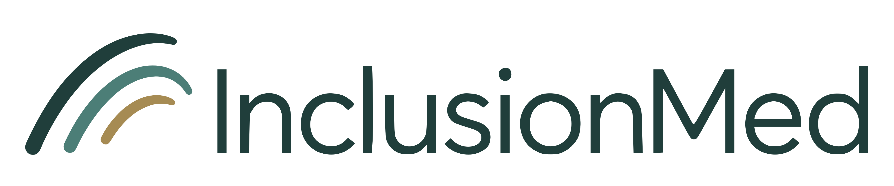

  <picture>
    <source media="(prefers-color-scheme: dark)" srcset="assets/figures/InclusionMed-confluence-reverse.png">
    
  </picture>

  <strong>包容的医疗智能，</strong> 
  <strong>立足真实医疗工作。</strong>

  &nbsp;
  &nbsp;
  

  &nbsp;
  &nbsp;
  

  <a href="README.md">English</a> · 中文

**InclusionMed** 是一个正在构建社区共建医疗 AI 评测框架的研究项目。我们将患者、医疗专业人员和医疗服务的实际需求，转化为结果可以检查、过程可以复现的评测任务。

完整的交互展示请访问 **[项目网站](https://testmiodemo.renderoffice-pre.antgroup-inc.cn/)**。本仓库集中提供项目介绍、共建指南、任务提案模板和评测记录清单。

## 📣 邀请参与共建

帮助我们识别值得评测的医疗工作：提出一个实际任务、推荐现有基准，或提供医学、工程、语言与本地情境方面的专业经验。**提出一个有价值的任务，不一定需要编写代码。**

请阅读 **[CONTRIBUTING.zh-CN.md](CONTRIBUTING.zh-CN.md)**，了解参与流程、提案要求和评审原则。可以先填写 [任务 / Benchmark 提案模板](assets/inclusionmed-task-proposal.md)，也可以在 [仓库 Issues](https://github.com/knight-flash/InclusionMed/issues) 中讨论想法或提出改进建议。

## 💥 为什么做 InclusionMed？

医疗工作并不只是回答医学问题，还包括就医导航、信息理解、治疗规划、服务协调、随访，以及研究和行政支持。不同的人、语言和医疗环境，对这些工作有不同的需求。

有价值的评测应说明：**任务代表谁的需求、衡量哪项工作，以及什么结果才算成功。** InclusionMed 希望将这些证据组织起来，让能力、局限和缺口更容易理解。

| 观察视角 | 我们关注的问题 |
| :--- | :--- |
| **Inclusion（包容性）** | 评测代表了哪些人、语言和医疗环境的需求？ |
| **Effectiveness（有效性）** | 系统完成实际医疗工作的效果如何？ |

两者是理解任务与结果的互补视角，并非已经发布的总分计算公式。更多背景见网站 [Mission](https://testmiodemo.renderoffice-pre.antgroup-inc.cn/mission)。

### 医疗任务地图

任务通过 **服务对象 × 医疗工作领域 × 能力** 三个维度描述。同一任务可以涉及多个角色或工作领域，分类应反映实际评测的工作。

| 维度 | 分类 |
| :--- | :--- |
| **服务对象** | 患者与家属；医疗专业人员；服务与行政人员 |
| **医疗工作领域** | 就医可及性；临床评估与诊断；照护规划；照护实施与协调；随访与监测；研究与教育；医疗行政管理 |
| **能力标签** | 医学知识；沟通；工作成果生成 |

<strong>展开查看七类医疗工作</strong>

| 工作领域 | 涵盖内容 |
| :--- | :--- |
| 就医可及性 | 就医导航、预约、转诊，以及经济或服务获取障碍 |
| 临床评估与诊断 | 症状与病史、检查、风险评估和诊断 |
| 照护规划 | 治疗、预防、健康管理的方案与计划 |
| 照护实施与协调 | 临床记录、交接、计划执行及照护协调 |
| 随访与监测 | 病情变化、治疗反应、安全性、依从性与持续支持 |
| 研究与教育 | 研究设计、证据综合、分析、研究成果与教学 |
| 医疗行政管理 | 保险、授权、支付、排期、资源及组织质量管理 |

例如，就医导航任务可以服务患者与家属，归入“就医可及性”，并涉及“沟通”能力。这是分类示例，并不是已经发布的 Benchmark。

### 研究方向

网站呈现了以下正在推进的方向。它们属于研究进展，不是已发布、可直接运行的基准目录。

| 方向 | 关注点 | 当前阶段 |
| :--- | :--- | :--- |
| Clinical Live Knowledge Bench | 随医学证据变化而更新的医学知识 | 规划中 |
| Single-response health conversations | 单次回复中的健康沟通 | 开发中 |
| Multi-Turn Bench | 多轮对话中的沟通 | 提议方向 |
| EHR Agentic Bench | 电子健康记录工作流程中的任务 | 开发中 |
| RSI AutoResearch Bench | 研究工作及其成果 | 开发中 |

### 评测应该怎样开展

任务应具有 **相关性、可信性、可用性、可复现性和互补性**，并关注 **代表性缺口**。医学参考与评分标准需要具备资质的人员审核；LLM 生成的标注不能作为参考标准。

每次评测应记录任务与数据版本、模型与配置、运行条件、评分与审核、结果与不确定性，以及复现与贡献署名。相关材料见 [评测记录清单](assets/inclusionmed-evaluation-checklist.md) 和网站 [Methodology](https://testmiodemo.renderoffice-pre.antgroup-inc.cn/methodology)。

结果应保留原始指标、评测条件和局限。缺失结果不等于零分；不同基准的结果需要经过明确的方法约定才能合并。

## 🔎 浏览 InclusionMed

| 网站页面 | 可以了解什么 |
| :--- | :--- |
| [Mission](https://testmiodemo.renderoffice-pre.antgroup-inc.cn/mission) | 为什么从包容性与有效性理解医疗智能 |
| [Index](https://testmiodemo.renderoffice-pre.antgroup-inc.cn/observatory) | 模型表现与比较的整体视图 |
| [Atlas](https://testmiodemo.renderoffice-pre.antgroup-inc.cn/atlas) | 按医疗工作组织的基准、覆盖与结果 |
| [Methodology](https://testmiodemo.renderoffice-pre.antgroup-inc.cn/methodology) | 拟议的准入、分类、评测和报告原则 |
| [Contribute](https://testmiodemo.renderoffice-pre.antgroup-inc.cn/contribute) | 如何提供医疗任务、基准和专业经验 |
| [Resources](https://testmiodemo.renderoffice-pre.antgroup-inc.cn/resources) | 项目材料与参考资源 |
| [About](https://testmiodemo.renderoffice-pre.antgroup-inc.cn/about) | 项目目的、研究背景和当前阶段 |

## 🚧 项目状态

链接的网站目前是 **预览版**。框架、评审流程和参与材料仍在开发中。

Index 分数与 Atlas 示例视图使用虚构数据。Atlas 的独立公开参考视图保留来源报告的结果与链接；这些结果不是 InclusionMed 自行评测或作出的准入决定。经过 InclusionMed 审核的结果、最终聚合方法和确认后的贡献者署名仍有待建立。

仓库 Issues 用于交流想法和反馈文档。完整的 Benchmark 准入与发布流程仍在完善，提交提案并不代表已经被接纳。

## 📚 资源

- [共建指南](CONTRIBUTING.zh-CN.md)
- [任务 / Benchmark 提案模板](assets/inclusionmed-task-proposal.md)
- [评测记录清单](assets/inclusionmed-evaluation-checklist.md)
- [英文介绍](README.md)
- [许可证](LICENSE)

## 🤝 Contributors（贡献者）

<table width="100%">
  <tr>
    <th colspan="4" align="left">项目发起人</th>
  </tr>
  <tr>
    <td colspan="4" align="left">Coming soon.</td>
  </tr>
  <tr>
    <th colspan="4" align="left">组织者</th>
  </tr>
  <tr>
    <td colspan="4" align="left">Coming soon.</td>
  </tr>
  <tr>
    <th colspan="4" align="left">顾问</th>
  </tr>
  <tr>
    <td colspan="4" align="left">Coming soon.</td>
  </tr>
  <tr>
    <th colspan="4" align="left">任务贡献者</th>
  </tr>
  <tr>
    <td colspan="4" align="left">Coming soon.</td>
  </tr>
</table>
